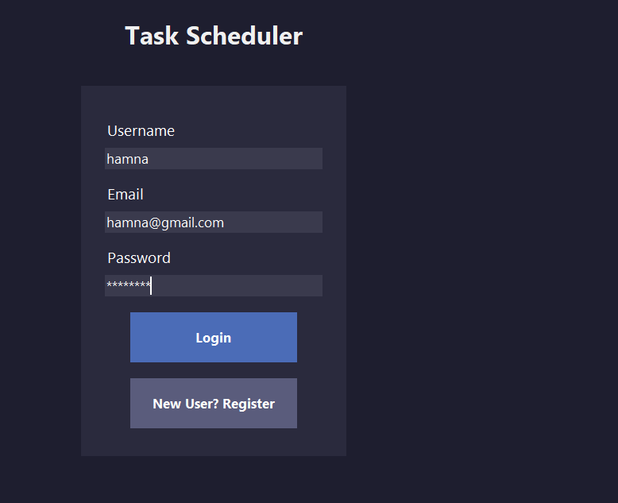
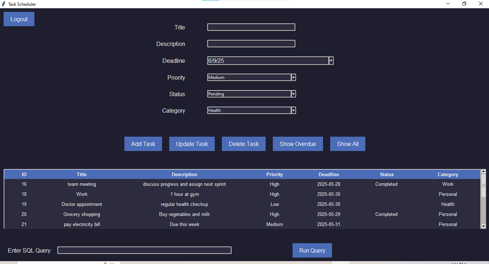
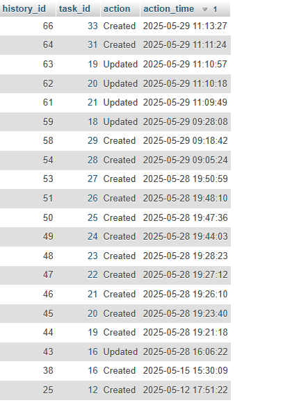

# 📝 Task Scheduler Application

A modern, feature-rich Python desktop application designed to streamline daily task management. This application provides a secure environment for users to organize, track, and prioritize their work using a graphical interface and a persistent MySQL database.

# 📝 Task Scheduler Application

A professional Python-based desktop application for managing daily tasks, tracking deadlines, and maintaining productivity.

---

## 🖼️ Application Gallery

> These images are located in your `/screenshots` folder. Ensure the filenames match exactly (e.g., `welcome.png`).

| Welcome Screen | Login & Security |
| :---: | :---: |
|  |  |

| Task Dashboard | Data History |
| :---: | :---: |
|  |  |

---

## ✨ Features

* **Modern UI**: Dark-themed interface with an animated bubble background on the landing page.
* **User Accounts**: Secure login/registration using **SHA-256 password hashing**.
* **Full CRUD**: Create, Read, Update, and Delete tasks with custom priorities and categories.
* **Deadline Management**: Built-in calendar for setting dates and automatic "Overdue" status tracking.
* **Audit Trail**: Every action (task creation, updates, completion) is logged in a `TaskHistory` table.
* **SQL Console**: Advanced feature to run custom queries directly within the app.

---

## 🛠️ Technical Setup

### 1. Requirements
* Python 3.x
* MySQL (XAMPP or local server)
* Libraries: `mysql-connector-python`, `tkcalendar`

### 2. Installation

pip install mysql-connector-python tkcalendar

## ✨ Key Features

- **Interactive UI**: Features a dynamic welcome screen with an animated bubble background.
- **Secure Authentication**: User registration and login with **SHA-256 password encryption**.
- **Task Management (CRUD)**: Create, view, update, and delete tasks with ease.
- **Smart Tracking**: 
    - **Deadlines**: Integrated calendar system (`tkcalendar`) for precise scheduling.
    - **Priority**: Assign Low, Medium, or High priority levels.
    - **Status**: Mark tasks as "Pending" or "Completed".
- **Category System**: Multi-category support to organize tasks by Work, Personal, etc.
- **Audit Logs**: A built-in `TaskHistory` system that tracks every change made to your tasks.
- **Data Persistence**: Powered by a relational MySQL database for reliable storage.

---

## 🛠️ Technology Stack

* **Frontend**: Python (Tkinter & ttk)
* **Database**: MySQL
* **Libraries**: `mysql-connector-python`, `tkcalendar`, `hashlib`

---

## 🚀 Installation & Setup

### 1. Prerequisites
Ensure you have **Python 3.x** and **MySQL** (via XAMPP or MySQL Server) installed.

### 2. Install Dependencies
Run the following command to install the required Python libraries:
```bash
pip install mysql-connector-python tkcalendar
